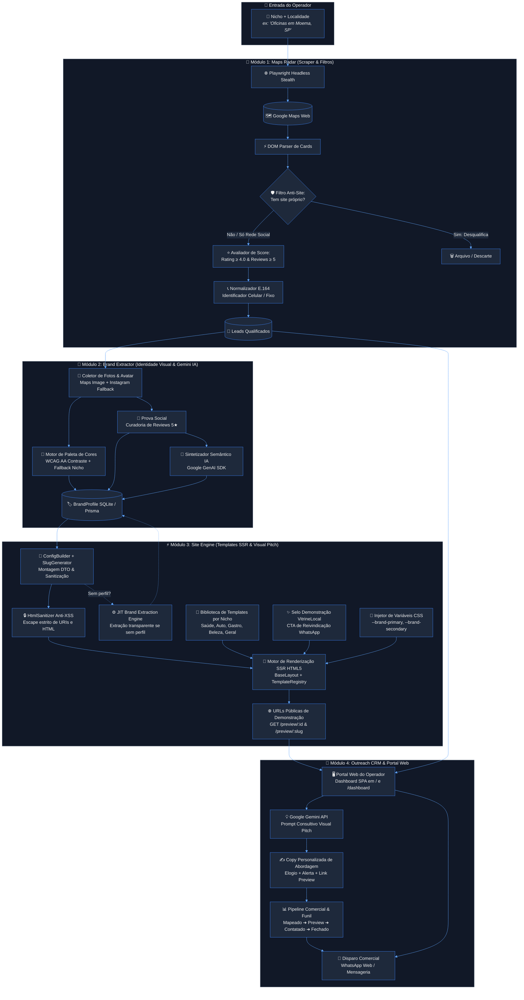
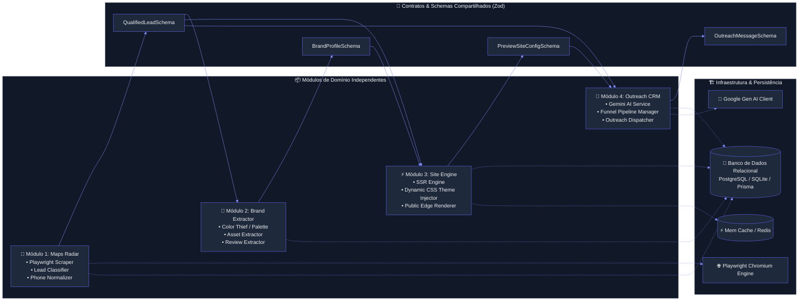
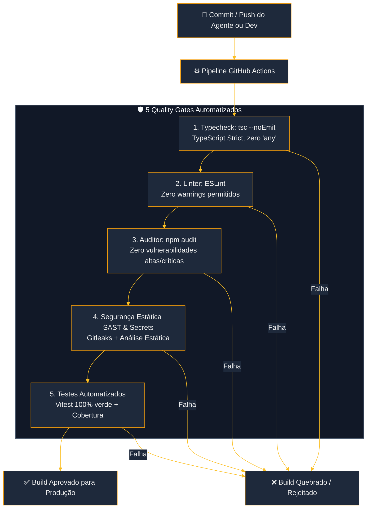

# Arquitetura do Sistema — VitrineLocal

Este documento descreve a arquitetura técnica completa, o fluxo de dados de ponta a ponta e o desacoplamento modular do ecossistema **VitrineLocal**.

---

## 1. Visão Geral e Fluxo de Valor de Ponta a Ponta

O VitrineLocal opera como um pipeline contínuo de 4 módulos integrados através de contratos de dados estritos, transformando uma busca geográfica em propostas comerciais de alto impacto (Visual Pitch).

---

## 2. Arquitetura em Camadas e Desacoplamento Modular (Clean Architecture)

Cada módulo do sistema é uma unidade isolada que não depende dos detalhes de implementação dos outros módulos. A comunicação ocorre exclusivamente através de **DTOs tipados e Schemas Zod compartilhados**.

---

## 3. Modelo de Entidades e Ciclo de Vida do Lead

```mermaid
%%{init: {'theme':'base', 'themeVariables': { 'darkMode': true, 'background': '#0f172a', 'mainBkg': '#1e293b', 'nodeBorder': '#10b981', 'clusterBkg': '#111827', 'titleColor': '#f8fafc', 'textColor': '#f1f5f9', 'lineColor': '#34d399'}}}%%
stateDiagram-v2
    [*] --> MINERADO: Módulo 1 (Extração do Google Maps)
    MINERADO --> QUALIFICADO: Passou no filtro anti-site e nota >= 4.0
    MINERADO --> DESQUALIFICADO: Já possui site próprio ou nota baixa

    QUALIFICADO --> IDENTIDADE_EXTRAIDA: Módulo 2 (Cores, fotos e depoimentos)
    IDENTIDADE_EXTRAIDA --> PREVIEW_PRONTO: Módulo 3 (Indicador derivado: brandProfile !== null)

    PREVIEW_PRONTO --> CONTATADO: Módulo 4 (Disparo WhatsApp confirmado; preenche contactedAt e outreachCopy)
    CONTATADO --> EM_NEGOCIACAO: Cliente respondeu / visualizou preview
    EM_NEGOCIACAO --> CONVERTIDO: Venda fechada (Site contratado)
    EM_NEGOCIACAO --> DESQUALIFICADO: Recusou proposta ou sem interesse
```

---

## 4. Esteira de Produção & Quality Gates (CI/CD)

Nenhum código entra em produção ou é integrado à branch principal sem passar pelos cinco filtros inegociáveis de engenharia:

