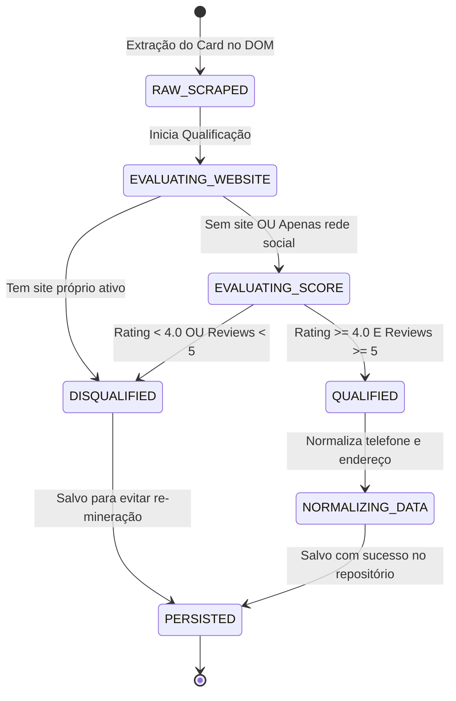

# Data Model: Módulo 1 — Maps Radar

Este documento especifica os modelos de dados, schemas de validação Zod, regras de transição de estado e estratégias de persistência para o **Módulo 1: Maps Radar**.

---

## 1. Entidades de Domínio

### 1.1 `RawMapsLead` (Entrada Bruta da Extração)
Representa os dados textuais crus extraídos diretamente do DOM do Google Maps antes de qualquer higienização.

| Campo | Tipo | Obrigatório | Descrição |
|---|---|---|---|
| `businessName` | `string` | Sim | Nome fantasia exibido no card do Maps |
| `category` | `string` | Não | Categoria comercial descrita (ex: "Oficina mecânica") |
| `address` | `string` | Não | Endereço formatado exibido no Maps |
| `phone` | `string` | Não | String de telefone no formato exibido no Maps |
| `website` | `string` | Não | URL bruta contida no botão/link de website |
| `rating` | `number` | Não | Nota média de 1.0 a 5.0 |
| `reviewCount` | `number` | Não | Quantidade de avaliações |
| `mapsUrl` | `string` | Sim | URL permanente do card do estabelecimento |

---

### 1.2 `QualifiedLead` (Entidade Principal do Módulo)
Representa o lead pós-higienização, normalizado e com avaliação de qualificação comercial calculada.

| Campo | Tipo | Descrição |
|---|---|---|
| `id` | `string (UUID v4)` | Identificador único do lead no sistema |
| `businessName` | `string` | Nome fantasia higienizado |
| `category` | `string` | Categoria principal |
| `address` | `string \| null` | Endereço completo normalizado |
| `phoneRaw` | `string \| null` | Telefone bruto original |
| `phoneNormalized` | `string \| null` | Telefone no formato E.164 (ex: `+5511998765432`) |
| `isMobile` | `boolean` | `true` se for celular/WhatsApp, `false` se fixo |
| `websiteRaw` | `string \| null` | Website bruto original |
| `websiteType` | `WebsiteClassification` | `'NO_WEBSITE' \| 'SOCIAL_ONLY' \| 'OWN_WEBSITE'` |
| `socialLinks` | `string[]` | Links de redes sociais detectados |
| `rating` | `number` | Nota do Maps (default: 0.0) |
| `reviewCount` | `number` | Total de avaliações (default: 0) |
| `qualificationScore` | `number` | Pontuação calculada de 0 a 100 |
| `status` | `QualificationStatus` | `'QUALIFIED' \| 'DISQUALIFIED'` |
| `disqualificationReason` | `string \| null` | Motivo do descarte caso desqualificado |
| `mapsUrl` | `string` | Link permanente do Google Maps |
| `searchJobId` | `string` | ID da busca que originou o lead |
| `createdAt` | `Date` | Timestamp de criação |
| `updatedAt` | `Date` | Timestamp de atualização |

---

### 1.3 `SearchJob` (Sessão de Mineração)
Representa uma busca disparada pelo operador.

| Campo | Tipo | Descrição |
|---|---|---|
| `id` | `string (UUID v4)` | ID da sessão de busca |
| `niche` | `string` | Nicho buscado (ex: "Oficina Mecânica") |
| `location` | `string` | Bairro/Cidade (ex: "Moema, São Paulo") |
| `limitRequested` | `number` | Quantidade máxima de estabelecimentos solicitada |
| `totalFound` | `number` | Total de cards brutos inspecionados |
| `totalQualified` | `number` | Total de leads que passaram nos filtros |
| `totalDisqualified`| `number` | Total de leads descartados |
| `status` | `JobStatus` | `'PENDING' \| 'RUNNING' \| 'COMPLETED' \| 'FAILED'` |
| `errorMessage` | `string \| null` | Log de erro caso o job falhe |
| `startedAt` | `Date` | Horário de início |
| `finishedAt` | `Date \| null` | Horário de conclusão |

---

## 2. Schemas Zod de Validação de Contrato

```typescript
import { z } from 'zod';

export const WebsiteClassificationEnum = z.enum([
  'NO_WEBSITE',
  'SOCIAL_ONLY',
  'OWN_WEBSITE'
]);

export const QualificationStatusEnum = z.enum([
  'QUALIFIED',
  'DISQUALIFIED'
]);

export const RawMapsLeadSchema = z.object({
  businessName: z.string().min(1, 'Nome fantasia obrigatório'),
  category: z.string().optional().default('Serviços Locais'),
  address: z.string().optional().nullable(),
  phone: z.string().optional().nullable(),
  website: z.string().url().optional().nullable().or(z.literal('')),
  rating: z.number().min(0).max(5).optional().default(0),
  reviewCount: z.number().int().min(0).optional().default(0),
  mapsUrl: z.string().url('URL do Google Maps inválida')
});

export const QualifiedLeadSchema = z.object({
  id: z.string().uuid(),
  businessName: z.string().min(1),
  category: z.string(),
  address: z.string().nullable(),
  phoneRaw: z.string().nullable(),
  phoneNormalized: z.string().regex(/^\+55\d{10,11}$/, 'Formato E.164 inválido').nullable(),
  isMobile: z.boolean(),
  websiteRaw: z.string().nullable(),
  websiteType: WebsiteClassificationEnum,
  socialLinks: z.array(z.string().url()),
  rating: z.number().min(0).max(5),
  reviewCount: z.number().int().min(0),
  qualificationScore: z.number().min(0).max(100),
  status: QualificationStatusEnum,
  disqualificationReason: z.string().nullable().optional(),
  mapsUrl: z.string().url(),
  searchJobId: z.string().uuid(),
  createdAt: z.date(),
  updatedAt: z.date()
});

export const SearchParamsSchema = z.object({
  niche: z.string().min(2, 'Nicho deve ter pelo menos 2 caracteres'),
  location: z.string().min(2, 'Localidade deve ter pelo menos 2 caracteres'),
  limit: z.number().int().min(1).max(100).default(20)
});
```

---

## 3. Máquina de Estados e Transições



---

## 4. Estratégia de Deduplicação e Índices

Para evitar minerar o mesmo estabelecimento múltiplas vezes e não gastar processamento à toa:
- **Chave Primária Natural:** `mapsUrl` (a URL única de identificação do Google Maps).
- **Chave Composta Secundária:** `slug(businessName) + '-' + phoneNormalized`.
- Se o lead já existir no banco:
  - Atualiza métricas mutáveis (`rating`, `reviewCount`);
  - Preserva o status anterior e histórico.
