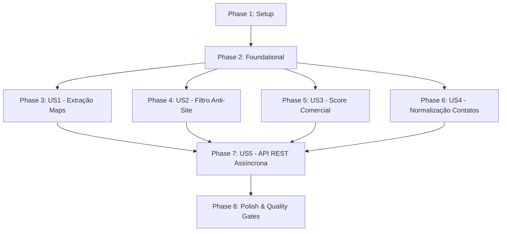

# Tasks: Módulo 1 — Maps Radar (Scraper & Qualificação de Leads)

**Feature**: `001-maps-radar` | **Status**: Ready for Implementation  
**Spec**: [spec.md](file:///Users/rodrigobelarmino/Documents/DEV/VitrineLocal/specs/001-maps-radar/spec.md) | **Plan**: [plan.md](file:///Users/rodrigobelarmino/Documents/DEV/VitrineLocal/specs/001-maps-radar/plan.md)

---

## Phase 1: Setup (Shared Infrastructure & Quality Gates)

**Purpose**: Inicialização do projeto, ambiente TypeScript estrito, linters, Prisma ORM e suíte de testes.

- [ ] T001 Inicializar projeto Node.js 24.21.0 LTS com `package.json` configurado em `/package.json`
- [ ] T002 [P] Configurar TypeScript 7.0.2 em modo estrito (`strict: true`, `noImplicitAny: true`, `exactOptionalPropertyTypes: true`) em `/tsconfig.json`
- [ ] T003 [P] Configurar ESLint e Prettier com política de zero warnings em `/.eslintrc.json` e `/.prettierrc`
- [ ] T004 [P] Configurar Vitest com relatório de cobertura v8 em `/vitest.config.ts`
- [ ] T005 [P] Inicializar Prisma ORM com provider SQLite em `/prisma/schema.prisma`
- [ ] T006 Configurar scripts de Quality Gates (`typecheck`, `lint`, `audit`, `test`, `test:coverage`) em `/package.json`
- [ ] T007 [P] Configurar workflow de CI do GitHub Actions com os 5 quality gates em `/.github/workflows/ci.yml`

---

## Phase 2: Foundational (Blocking Prerequisites)

**Purpose**: Contratos tipados, modelos de dados no Prisma, fila sequencial assíncrona (FIFO) e infraestrutura compartilhada.

**⚠️ CRITICAL**: Nenhuma User Story pode ser implementada antes do término desta fase.

- [ ] T008 Implementar schemas Zod de validação em runtime (`RawMapsLeadSchema`, `QualifiedLeadSchema`, `SearchParamsSchema`) em `/src/modules/radar/schemas/radar.schemas.ts`
- [ ] T009 Definir modelos Prisma (`SearchJob` e `QualifiedLead`) e executar migration inicial em `/prisma/schema.prisma`
- [ ] T010 [P] Implementar classes de erro tipadas (`ScrapingError`, `ValidationError`, `NotFoundError`) em `/src/shared/errors/app-error.ts`
- [ ] T011 [P] Implementar logger estruturado com níveis e saída JSON em `/src/shared/logger/logger.ts`
- [ ] T012 Implementar contrato de repositório `ILeadRepository` e implementação Prisma em `/src/modules/radar/repositories/prisma-lead.repository.ts`
- [ ] T013 Implementar fila sequencial assíncrona FIFO com concorrência máxima de 1 job ativo em `/src/modules/radar/core/job-queue.ts`
- [ ] T014 [P] Criar fixtures HTML estáticas de busca e cards do Google Maps para testes offline em `/src/modules/radar/__tests__/fixtures/search-feed.html`

**Checkpoint**: Fundação pronta — contratos, banco de dados, fila FIFO e fixtures de teste estabelecidos.

---

## Phase 3: User Story 1 - Extração de Leads via Google Maps com Playwright (Priority: P1) 🎯 MVP

**Goal**: Permitir a navegação headless stealth no Google Maps por nicho e localidade, rolando o feed de resultados e extraindo os dados brutos dos cards sem depender de APIs oficiais pagas.

**Independent Test**: Executar o teste de unidade offline contra as fixtures HTML e em seguida uma busca de fumaça Playwright headless mockada, verificando que os cards contêm nome, categoria, telefone bruto, endereço e website.

### Tests for User Story 1 (TDD - Red Phase)
- [ ] T015 [P] [US1] Escrever testes unitários para o parser de cards do DOM usando fixtures HTML estáticas em `/src/modules/radar/__tests__/dom-parser.test.ts`
- [ ] T016 [P] [US1] Escrever testes para o gerenciador de browser e detecção de encerramento do feed em `/src/modules/radar/__tests__/maps-scraper.test.ts`

### Implementation for User Story 1
- [ ] T017 [P] [US1] Mapear seletores CSS e atributos do DOM do Google Maps em `/src/modules/radar/scraper/maps-selectors.ts`
- [ ] T018 [US1] Implementar o parser seguro de DOM com Cheerio/Playwright para extrair `RawMapsLead` em `/src/modules/radar/scraper/dom-parser.ts` (satisfaz T015)
- [ ] T019 [P] [US1] Implementar gerenciador de contexto Playwright com flags de anti-fingerprinting e stealth em `/src/modules/radar/scraper/browser-pool.ts`
- [ ] T020 [US1] Implementar orquestrador de scraping com rolagem infinita, delays humanos (1.2s a 2.8s) e parada graciosa ao fim do feed em `/src/modules/radar/scraper/maps-scraper.ts` (satisfaz T016)

**Checkpoint**: Extração bruta do Google Maps funcional e 100% testada com fixtures offline.

---

## Phase 4: User Story 2 - Filtro Anti-Site e Qualificação de Presença Digital (Priority: P1)

**Goal**: Inspecionar o campo de website dos estabelecimentos e classificá-los determinística e confiavelmente entre `NO_WEBSITE`, `SOCIAL_ONLY` e `OWN_WEBSITE`.

**Independent Test**: Fornecer uma bateria de pelo menos 30 URLs variadas (redes sociais, links nulos, domínios próprios) e validar 100% de acerto na classificação.

### Tests for User Story 2 (TDD - Red Phase)
- [ ] T021 [P] [US2] Escrever testes unitários exaustivos para o classificador de websites em `/src/modules/radar/__tests__/website-classifier.test.ts`

### Implementation for User Story 2
- [ ] T022 [US2] Implementar classificador determinístico de URLs com whitelist de redes sociais (`instagram.com`, `facebook.com`, `linktr.ee`, `wa.me`, etc.) em `/src/modules/radar/core/website-classifier.ts` (satisfaz T021)

**Checkpoint**: Filtro Anti-Site concluído, permitindo segregar empresas sem site próprio.

---

## Phase 5: User Story 3 - Filtro de Reputação & Score Comercial (Priority: P2)

**Goal**: Calcular pontuação comercial (0 a 100) baseada em nota média e quantidade de avaliações, priorizando negócios estabelecidos.

**Independent Test**: Passar conjuntos de leads com notas e contagens de reviews variadas e verificar o score e status de qualificação correspondente.

### Tests for User Story 3 (TDD - Red Phase)
- [ ] T023 [P] [US3] Escrever testes unitários para a fórmula de score comercial e qualificação em `/src/modules/radar/__tests__/lead-scorer.test.ts`

### Implementation for User Story 3
- [ ] T024 [US3] Implementar algoritmo de score comercial (`score >= 40`, `rating >= 4.0`, `reviewCount >= 5`) em `/src/modules/radar/core/lead-scorer.ts` (satisfaz T023)

**Checkpoint**: Motor de qualificação e scoring comercial ativo e validado.

---

## Phase 6: User Story 4 - Normalização de Contatos & Deduplicação (Priority: P2)

**Goal**: Converter telefones brasileiros para o padrão canônico E.164, detectar linhas móveis (WhatsApp) e garantir persistência sem duplicatas no banco de dados.

**Independent Test**: Executar testes com formatos telefônicos com/sem DDD e tentar persistir leads repetidos validando a chave de deduplicação.

### Tests for User Story 4 (TDD - Red Phase)
- [ ] T025 [P] [US4] Escrever testes unitários para normalização telefônica e detecção de WhatsApp em `/src/modules/radar/__tests__/phone-normalizer.test.ts`
- [ ] T026 [P] [US4] Escrever testes de integração de persistência e deduplicação no repositório Prisma em `/src/modules/radar/__tests__/lead-repository.test.ts`

### Implementation for User Story 4
- [ ] T027 [US4] Implementar normalizador de telefone para padrão E.164 e detector `isMobile: true/false` em `/src/modules/radar/core/phone-normalizer.ts` (satisfaz T025)
- [ ] T028 [US4] Implementar lógica de deduplicação por `mapsUrl` e hash `businessName + phone` com persistência de leads `QUALIFIED` e `DISQUALIFIED` em `/src/modules/radar/core/lead-persister.ts` (satisfaz T026)

**Checkpoint**: Dados de contato higienizados e persistência idempotente validada.

---

## Phase 7: User Story 5 - API HTTP REST com Jobs Assíncronos & Polling (Priority: P1)

**Goal**: Disponibilizar servidor HTTP com endpoints REST para disparo de busca assíncrona (`POST /api/radar/search`), consulta de status do job (`GET /api/radar/jobs/:id`) e listagem paginada de leads (`GET /api/radar/leads`).

**Independent Test**: Realizar requisições HTTP de ponta a ponta com Supertest/Vitest comprovando o retorno `202 Accepted` imediato, polling de status e recuperação final dos leads.

### Tests for User Story 5 (TDD - Red Phase)
- [ ] T029 [P] [US5] Escrever testes de integração de API HTTP para os endpoints do Radar em `/src/api/__tests__/radar-routes.test.ts`

### Implementation for User Story 5
- [ ] T030 [US5] Implementar a fachada de serviço `RadarService` que coordena o scraper, normalizadores, fila FIFO e repositório Prisma em `/src/modules/radar/radar.service.ts`
- [ ] T031 [US5] Implementar rotas Express/Node HTTP (`POST /api/radar/search`, `GET /api/radar/jobs/:id`, `GET /api/radar/leads`) em `/src/api/routes/radar.routes.ts`
- [ ] T032 [US5] Configurar servidor HTTP principal da aplicação com middleware de erro e validação Zod em `/src/api/server.ts` (satisfaz T029)

**Checkpoint**: API REST HTTP do Maps Radar 100% funcional com processamento assíncrono em background.

---

## Phase 8: Polish & Production Quality Gates

**Purpose**: Verificação final da esteira de qualidade, testes de cobertura e documentação.

- [ ] T033 [P] Criar documentação técnica da API HTTP com exemplos de payload e respostas em `/docs/api-radar.md`
- [ ] T034 Executar e validar o checklist do `quickstart.md` em `/specs/001-maps-radar/quickstart.md`
- [ ] T035 Executar a esteira completa de Quality Gates locais (`npm run typecheck`, `npm run lint`, `npm run audit`, `npm run test:coverage`) garantindo cobertura >= 90%

---

## Dependencies & Execution Order

### Phase Dependencies

### Parallel Opportunities

- **Na Phase 1 (Setup)**: `T002`, `T003`, `T004`, `T005`, `T007` podem ser executados em paralelo.
- **Na Phase 2 (Foundational)**: `T010`, `T011`, `T014` podem rodar em paralelo.
- **Nas User Stories**: Os testes TDD de cada história (`T015`, `T016`, `T021`, `T023`, `T025`, `T026`, `T029`) são completamente independentes e podem ser escritos em paralelo.

---

## Implementation Strategy

### MVP First (Phases 1, 2 e 3 + 4)
1. Completar **Phase 1 (Setup)** e **Phase 2 (Foundational)**.
2. Implementar **Phase 3 (US1 - Extração)** e **Phase 4 (US2 - Anti-Site)**.
3. **Validar MVP**: Extrair e classificar empresas de um bairro sem site próprio.

### Incremental Delivery
1. Adicionar **Phase 5 (Score)** e **Phase 6 (Normalização & Deduplicação)**.
2. Adicionar **Phase 7 (API REST & Fila FIFO de Jobs)**.
3. Concluir **Phase 8 (Quality Gates & Documentação)**.
