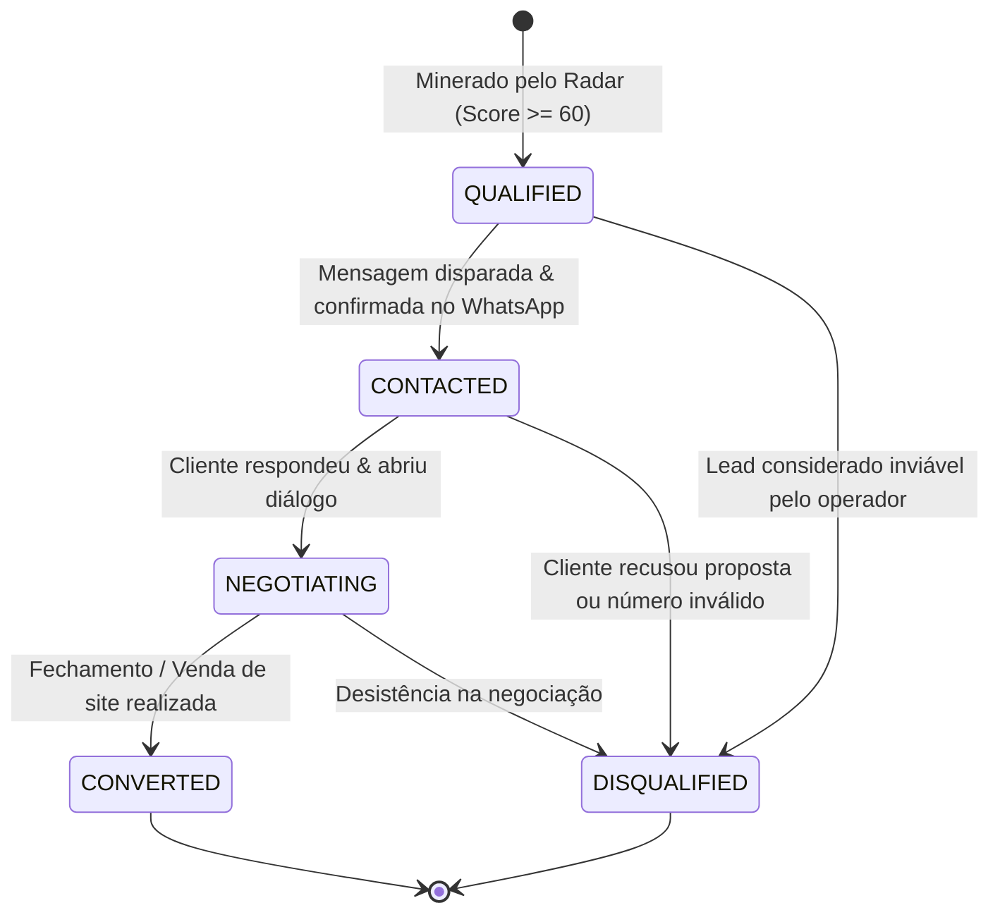

# Data Model & Schema Design: Módulo 4 — Outreach CRM & Portal Web

**Feature**: Módulo 4 — Outreach CRM & Portal Web  
**Date**: 2026-09-21  
**Status**: Approved

---

## 1. Evolução do Prisma Schema (`prisma/schema.prisma`)

Para suportar o acompanhamento do funil comercial, persistência da abordagem personalizada e registro cronológico do contato sem sobrecarregar a base com tabelas intermediárias no MVP:

```prisma
model QualifiedLead {
  id                     String        @id @default(uuid())
  slug                   String?       @unique
  businessName           String
  category               String        @default("Serviços Locais")
  address                String?
  phoneRaw               String?
  phoneNormalized        String?
  isMobile               Boolean       @default(false)
  websiteRaw             String?
  websiteType            String        // NO_WEBSITE, SOCIAL_ONLY, OWN_WEBSITE
  socialLinks            String        @default("[]") // JSON stringified array of URLs
  rating                 Float         @default(0.0)
  reviewCount            Int           @default(0)
  qualificationScore     Int           @default(0)

  // Pipeline Comercial (Módulo 4: Outreach CRM)
  status                 String        @default("QUALIFIED") // QUALIFIED, CONTACTED, NEGOTIATING, CONVERTED, DISQUALIFIED
  disqualificationReason String?
  outreachCopy           String?       // Última mensagem de abordagem personalizada gerada ou editada
  contactedAt            DateTime?     // Data e hora em que a abordagem no WhatsApp foi confirmada

  mapsUrl                String        @unique
  searchJobId            String?
  searchJob              SearchJob?    @relation(fields: [searchJobId], references: [id], onDelete: SetNull)
  brandProfile           BrandProfile?
  createdAt              DateTime      @default(now())
  updatedAt              DateTime      @updatedAt

  @@index([slug])
  @@index([status])
  @@index([phoneNormalized])
  @@index([category])
  @@index([contactedAt])
}
```

---

## 2. Máquina de Estados do Funil Comercial



> **Nota Arquitetural sobre "Preview Pronto":**  
> `PREVIEW_READY` não é um estado mutável no banco de dados. Trata-se de uma propriedade computada em tempo de execução:  
> `isPreviewReady = lead.brandProfile !== null`.  
> Isso evita acoplamento indevido entre a geração de páginas estáticas e o pipeline comercial do lead.

---

## 3. Schemas Zod & DTOs do Domínio

### 3.1 Transição de Status Comercial (`LeadStatusUpdateSchema`)

```typescript
export const LeadStatusEnum = z.enum([
  'QUALIFIED',
  'CONTACTED',
  'NEGOTIATING',
  'CONVERTED',
  'DISQUALIFIED',
]);

export const LeadStatusUpdateSchema = z.object({
  status: LeadStatusEnum,
  notes: z.string().optional(),
  outreachCopy: z.string().optional(),
});

export type LeadStatusUpdate = z.infer<typeof LeadStatusUpdateSchema>;
```

### 3.2 Resposta da Geração de Abordagem (`OutreachMessageResponseSchema`)

```typescript
export const OutreachMessageResponseSchema = z.object({
  leadId: z.string().uuid(),
  businessName: z.string(),
  phoneNormalized: z.string().nullable(),
  isMobile: z.boolean(),
  previewUrl: z.string().url(),
  messageText: z.string().min(10),
  whatsappDispatchLink: z.string().url(),
  generatedVia: z.enum(['GEMINI_AI', 'FALLBACK_SYNTHESIZER']),
});

export type OutreachMessageResponse = z.infer<typeof OutreachMessageResponseSchema>;
```

### 3.3 Métricas Consolidadas do Portal (`PortalStatsResponseSchema`)

```typescript
export const PortalStatsResponseSchema = z.object({
  totalMined: z.number().int().nonnegative(),
  totalQualified: z.number().int().nonnegative(),
  totalPreviewsReady: z.number().int().nonnegative(),
  totalContacted: z.number().int().nonnegative(),
  totalConverted: z.number().int().nonnegative(),
});

export type PortalStatsResponse = z.infer<typeof PortalStatsResponseSchema>;
```

### 3.4 Item de Listagem na Tabela do Portal (`PortalLeadItemDTO`)

```typescript
export interface PortalLeadItemDTO {
  id: string;
  slug: string | null;
  businessName: string;
  category: string;
  address: string | null;
  phoneRaw: string | null;
  phoneNormalized: string | null;
  isMobile: boolean;
  rating: number;
  reviewCount: number;
  qualificationScore: number;
  status: 'QUALIFIED' | 'CONTACTED' | 'NEGOTIATING' | 'CONVERTED' | 'DISQUALIFIED';
  isPreviewReady: boolean;
  previewUrl: string;
  outreachCopy: string | null;
  contactedAt: string | null;
  createdAt: string;
}
```

---

## 4. Regras de Validação e Integridade

1. **Sanitização de Telefone**: O link do WhatsApp deve ser gerado utilizando estritamente o `phoneNormalized` (DDI 55 + DDD + 8 ou 9 dígitos sem caracteres especiais como `(`, `)`, `-` ou espaços).
2. **Imutabilidade de Lead Inexistente**: Qualquer tentativa de atualizar status ou gerar copy para um `leadId` inexistente deve retornar `404 Not Found` com código `LEAD_NOT_FOUND`.
3. **Persistência de Edições**: Quando o operador customiza a copy no portal e confirma o envio no WhatsApp, a rota `PATCH /api/outreach/leads/:id/status` com `{ status: 'CONTACTED', outreachCopy: '...' }` deve salvar tanto o novo status quanto a string final da mensagem.
4. **Data de Contato Automática**: Ao transicionar o status para `CONTACTED`, se o campo `contactedAt` estiver vazio, o backend deve preenchê-lo com `new Date()`.
